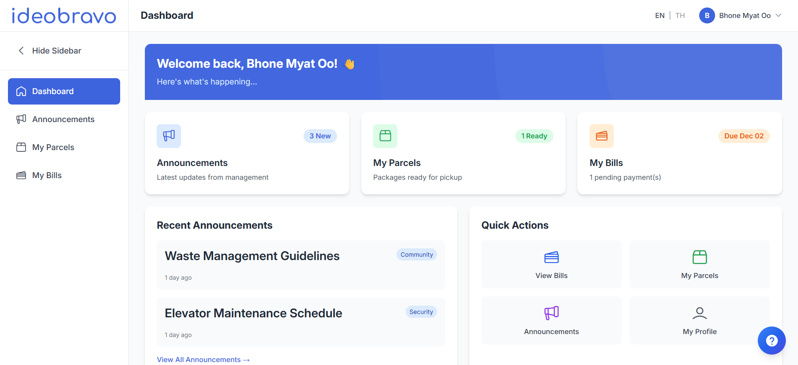
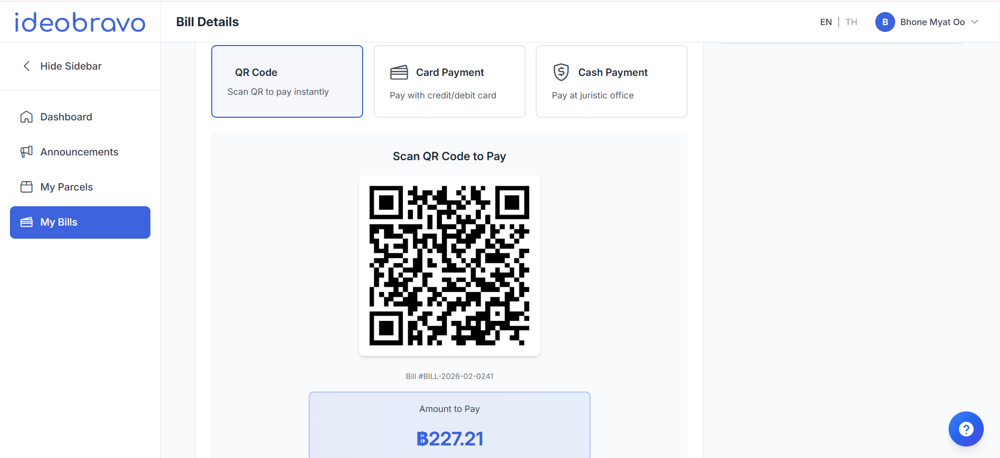
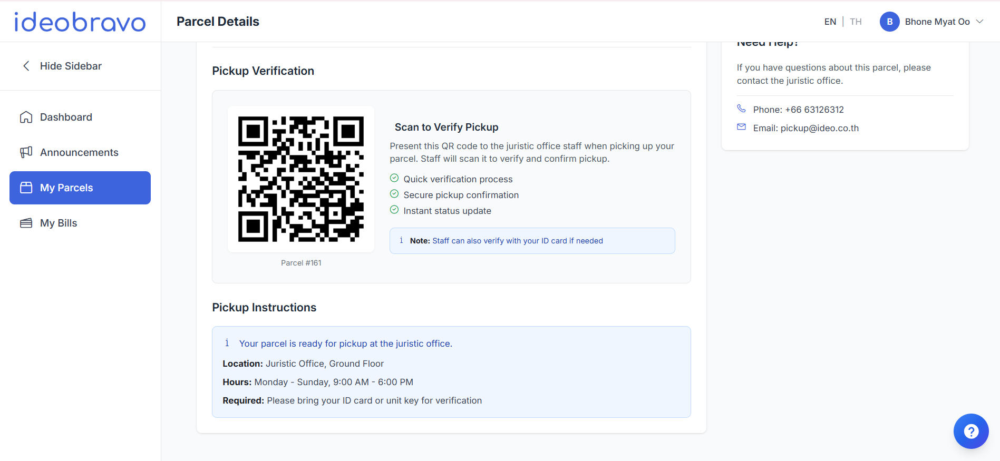
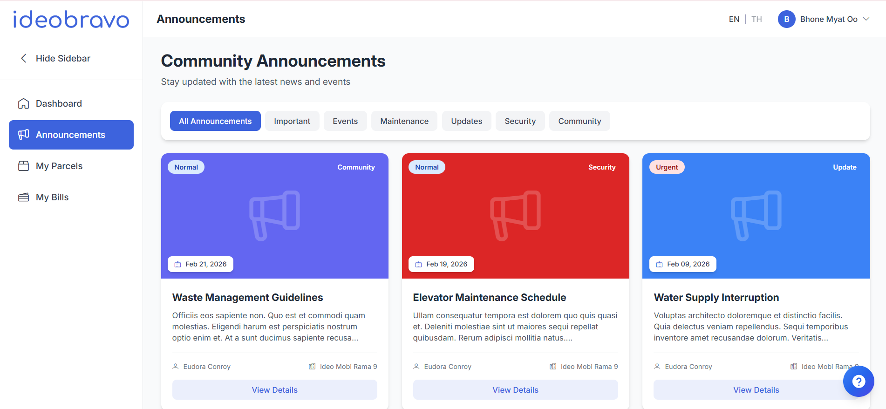

IdeoBravo
Condominium Resident Billing and Parcel Management System
<!-- LOGO --> 

 
	 
 
	
 An integrated digital management system for Ideo condominium operations — built for residents, managed by staff. 

 
________________________________________
<!-- BADGES --> 

 
	 
	 
	 
	 
	 
 
________________________________________
📌 About the Project
IdeoBravo is an integrated web-based management platform designed to replace Ideo's current fragmented operations. It unifies resident management, digital billing, parcel tracking, and announcements into one centralized system.
The system is built for Ideo condominiums in Bangkok, Thailand to address operational challenges faced by staff and residents.
________________________________________
🖼️ IdeoBravo Demo
Dashboard

  
 
Resident Portal

  
 
Billing System

  
 
Parcel Management

  
 
Announcements

  
 
________________________________________
✨ Features
Resident Account Management
•	Resident self-service portal to view and manage personal information
•	Role-based access for residents, staff, and admin
Digital Billing System
•	Digital delivery of electric, water, and insurance bills to resident portals
•	QR code payment integration
•	Payment tracking and confirmation by staff
•	Full bill payment history for residents
Parcel Management
•	Staff parcel logging with room number, image, and generated ID
•	Resident parcel notifications
•	Verified pickup confirmation system
Announcement System
•	Resident-only announcement channel (no public access)
•	Secure access replacing the public LINE QR code system
Admin Reporting Dashboard
•	Comprehensive data reports across all modules
•	Consolidated records replacing fragmented third-party software
________________________________________
🛠️ Tech Stack
Layer	Technology
Backend Framework	Laravel (PHP)

Frontend Styling	Tailwind CSS

Authentication	Laravel Breeze

Database	MySQL
Architecture	MVC (Model-View-Controller)
Methodology	DSDM (Dynamic Systems Development Method)
________________________________________
⚙️ Installation
Prerequisites
•	PHP version 8.1
•	Composer
•	Node.js & NPM
•	MySQL
Setup
# Clone the repository
git clone https://github.com/your-username/ideobravo.git
cd ideobravo

# Install PHP dependencies
composer install

# Install Node dependencies
npm install

# Copy environment file
cp .env.example .env

# Generate app key
php artisan key:generate

# Configure your database in .env, then run migrations
php artisan migrate
# Build frontend assets
npm run dev

# Start the local server
php artisan serve
________________________________________
👥 User Roles
Role	Access
Admin	Full system access, reporting dashboard, user management
Staff	Billing management, parcel logging, announcements
Resident	Personal portal, bills, parcel notifications, announcements
________________________________________
🗓️ Development Timeline
The project follows the DSDM methodology with following timeboxes:
Timebox	Name	Duration
Timebox 1	User Management + Announcement System	27 days
Timebox 2	Digital Billing System	26 days
Timebox 3	Parcel Management + Reporting	25 days
________________________________________
⚖️ Legal & Compliance
IdeoBravo is designed in compliance with:
•	General Data Protection Act (GDPA)
•	Thailand's Personal Data Protection Act (PDPA)
•	Thailand Condominium Act 
________________________________________
👨‍💻 Author
Bhone Myat Oo B.Sc (Hons) Computing — KMD, Myanmar. Banner ID: 001510377
________________________________________
📄 License
This project is developed as an academic project for COMP1682 Final Year Project
________________________________________
